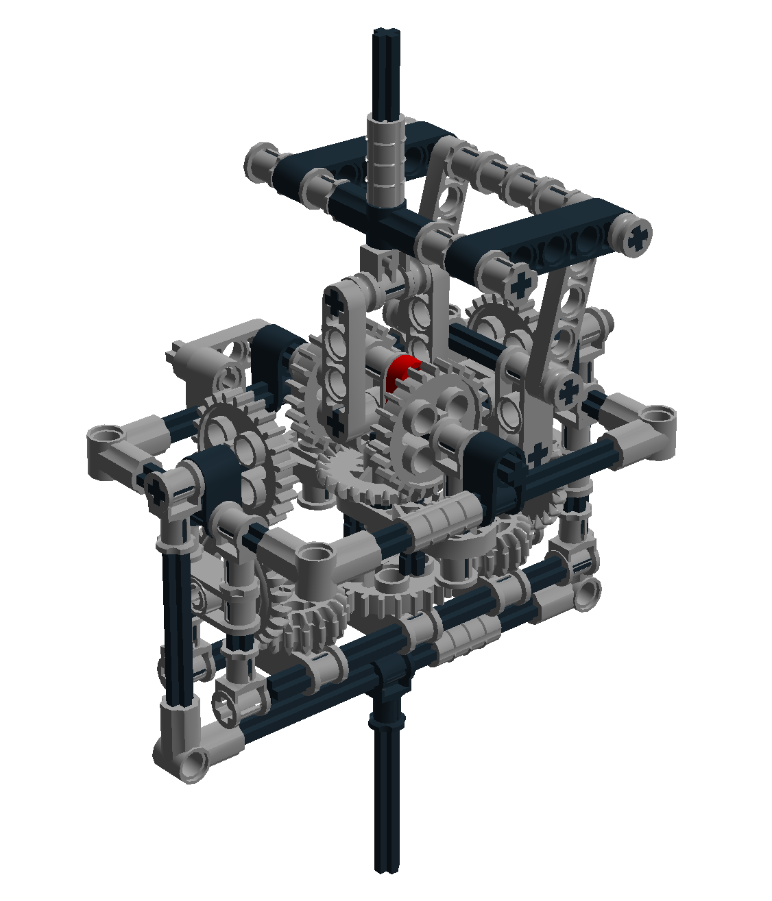

# RCVJ

This is home of the Reininghaus Constant Velocity Joint RCVJ, a possibly innovative solution to build a constant velocity joint. 
See https://en.wikipedia.org/wiki/Constant-velocity_joint.

## Motivation

The idea for this new solution came to me, when I tried to build a constant velocity joint using exclusively LEGO &trade; parts.

Because the proposed RCVJ mechanism has a high grade of complexity compared to the CV joints commonly in use (Birfield, Rzeppa, Tripods) and the gears introduce an additional amount of friction, it is likely that there will be no usefull applications. None the less it is a beautiful mechanism to watch moving.

## Solution

The patented [Thompson Coupling ](https://en.wikipedia.org/wiki/Constant-velocity_joint#Thompson_coupling) &reg; transfers the shaft torque via a double gimbal, whereas the spherical pantograph establishes the perpendicular to the homocinetic plane. To accomplish this the pantograph scissor mechanism acts as a spatial angle bisector mechanism.

In the RCVJ mechanism the spherical pantograph is replaced by two differential gears, one for each gimbal. The differential gears form the angle bisector mechanism for their respective plane and act perpendicularly to each other. We could therefore call it a differential bisecting constant velocity joint. This way the spherical problem is reduced to a two-dimensional problem and the model can be realized using standard LEGO parts.

## Model

The LEGO model of the RCVJ was created with LDRAW and Lego Digital Designer (LDD).

[Youtube Video](https://www.youtube.com/embed/okMCTcgzmAw?ecver=2) of the model in action.

## Usage

Install any of the free programs supporting the LDRAW file format, e.g.

* LeoCAD http://www.leocad.org/download.html
* LDRAW http://ldraw.org/help/getting-started.html
* LDD http://ldd.lego.com/en-us/download

For LDD download this model [RCVJ.lxf](model/RCVJ.lxf). For LDRAW and LeoCAD download this model [RCVJ.ldr](model/RCVJ.ldr). Load the model file into the software. Have fun building the model.

## License

 This work is licensed under a <a rel="license" href="http://creativecommons.org/licenses/by-nc-sa/4.0/">Creative Commons Attribution-NonCommercial-ShareAlike 4.0 International License</a>.
