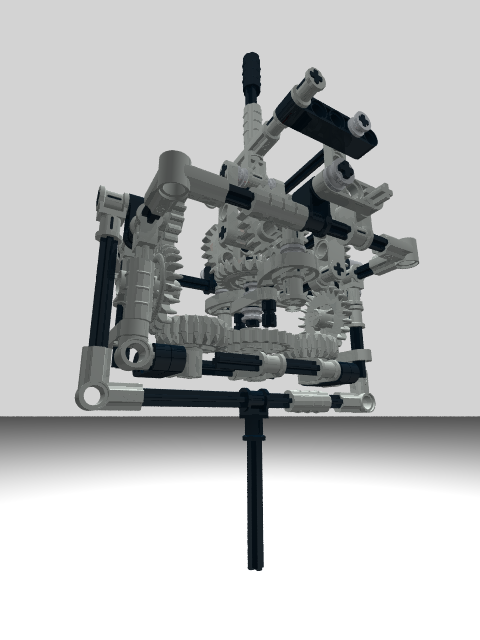

# RCVJ

This is home of the Reininghaus Constant Velocity Joint RCVJ, a maybe new solution to build a constant velocity Joint. 
See https://en.wikipedia.org/wiki/Constant-velocity_joint.

## Motivation

The idea for this new solution came to me, when I tried to build a constant velocity joint only using LEGO &copy; parts.

Because the RCVJ mechanism is to complex and has to much friction, it is likely that there will be no usefull applications. None the less it is a beautiful mechanism to watch moving.

## Solution

In case of the patented Thompson Coupling &reg; &trade; the double gimbal transfers the shaft torque while the spherical pantograph establishes the perpendicular to the homocinetic plane. To accomplish this the pantograph scissor mechanism acts as a spatial angle bisector mechanism.

In the RCVJ model the spherical pantograph is replaced by two differential gears, one for each gimbal. The differential gears are forming the angle bisector mechanism for their respective plane and are acting perpendicular to each other. This way the spherical problem is reduced to a two-dimensional problem and the model can be realized using standard LEGO parts.

## Model

The LEGO model of the RCVJ published here was done in LDRAW format.

## Usage

Install any of the free programs supporting the LDRAW file format, e.g.

* LeoCAD http://www.leocad.org/download.html
* LDRAW http://ldraw.org/help/getting-started.html
* LEGO Digital Designer (LDD) http://ldd.lego.com/en-us/download

Download this model [RCVJ.ldr](model/RCVJ.ldr) and load it into the software. Have fun building the model.

## License

 This work is licensed under a <a rel="license" href="http://creativecommons.org/licenses/by-nc-sa/4.0/">Creative Commons Attribution-NonCommercial-ShareAlike 4.0 International License</a>.
